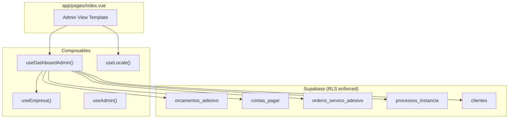
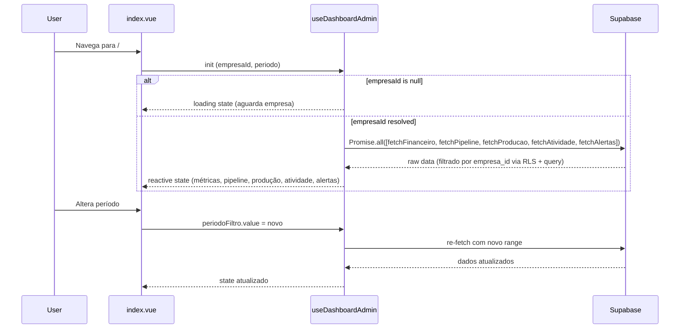

# Design Document: Dashboard Visão Geral

## Overview

Redesenho completo da seção admin/gerente do dashboard principal (`app/pages/index.vue`) do SignPRO. O novo dashboard substitui a visão atual — que mistura métricas genéricas (agendamentos, produtos em estoque) e atalhos redundantes — por uma interface focada em métricas financeiras, pipeline de orçamentos, status de produção, atividade recente e alertas de prazos.

A solução mantém a arquitetura existente (Nuxt 3 + Supabase + TailwindCSS) e reutiliza composables já consolidados (`useEmpresa`, `useLocale`, `useAdmin`). Um novo composable `useDashboardAdmin` encapsula toda a lógica de dados, mantendo a page slim e testável.

### Design Decisions

| Decisão | Justificativa |
|---------|--------------|
| Composable único `useDashboardAdmin` | Centraliza queries, loading state e cálculos derivados, facilitando testes unitários e property-based sem dependência de componente Vue |
| Queries paralelas com `Promise.all` | Reduz tempo de carregamento — cada card fica independente para exibir skeleton |
| Computed derivados para Lucro e Alertas | Evita re-fetches; recalcula automaticamente quando o período muda |
| Sem biblioteca de gráficos | O pipeline usa badges/contadores simples; mantém bundle leve e consistente com o design system existente |
| Period filter via `ref` reativo | Alteração do período dispara `watch` que re-executa as queries automaticamente |

---

## Architecture



### Data Flow



---

## Components and Interfaces

### 1. `useDashboardAdmin` Composable

```typescript
// app/composables/useDashboardAdmin.ts

export type PeriodoFiltro = 'mes_atual' | 'semana_atual' | 'trimestre_atual' | 'ano_atual' | 'personalizado'

export interface PeriodoRange {
  inicio: string  // ISO date string
  fim: string     // ISO date string
}

export interface MetricasFinanceiras {
  faturamento: number
  despesas: number
  lucroEstimado: number
  contasVencidas: number
  valorContasVencidas: number
}

export interface PipelineOrcamentos {
  rascunho: number
  enviado: number
  aprovado: number
  rejeitado: number
  vencido: number
  valorEmNegociacao: number  // sum of valor_total where status = 'enviado'
}

export interface StatusProducao {
  osEmProducao: number       // aguardando_producao + em_producao
  osProntas: number          // status = 'pronto'
  processosAtivos: number    // processos_instancia where data_conclusao is null
  osAtrasadas: number        // prazo_estimado <= today
}

export interface AtividadeItem {
  id: number
  tipo: 'orcamento_criado' | 'orcamento_aprovado' | 'os_criada' | 'conta_criada'
  descricao: string
  clienteNome: string | null
  criadoEm: string         // ISO timestamp
}

export interface AlertasDashboard {
  orcamentosExpirando: number   // enviados com validade <= 7 dias
  contasVencidas: number
  valorContasVencidas: number
  osAtrasadas: number
  temAlertas: boolean          // computed: any of above > 0
}

export interface DashboardAdminState {
  loading: Ref<boolean>
  financeiro: Ref<MetricasFinanceiras>
  pipeline: Ref<PipelineOrcamentos>
  producao: Ref<StatusProducao>
  atividades: Ref<AtividadeItem[]>
  alertas: Ref<AlertasDashboard>
  periodoFiltro: Ref<PeriodoFiltro>
  periodoCustom: Ref<{ mes: number; ano: number }>
  periodoRange: ComputedRef<PeriodoRange>
  periodoLabel: ComputedRef<string>
  refresh: () => Promise<void>
}

export function useDashboardAdmin(): DashboardAdminState
```

### 2. `calcularPeriodoRange` (Pure Function — testável)

```typescript
// app/utils/dashboard.ts

export function calcularPeriodoRange(
  filtro: PeriodoFiltro,
  custom: { mes: number; ano: number },
  hoje?: Date
): PeriodoRange
```

Converte o tipo de período selecionado em datas ISO de início e fim. Função pura, sem side-effects.

### 3. `buildAtividadeFeed` (Pure Function — testável)

```typescript
// app/utils/dashboard.ts

export interface RawEvent {
  id: number
  tipo: AtividadeItem['tipo']
  descricao: string
  clienteNome: string | null
  criadoEm: string
}

export function buildAtividadeFeed(events: RawEvent[], limit?: number): AtividadeItem[]
```

Ordena eventos por data decrescente e limita a `limit` (padrão 10).

### 4. `calcularAlertas` (Pure Function — testável)

```typescript
// app/utils/dashboard.ts

export interface AlertasInput {
  orcamentosEnviados: Array<{ created_at: string; validade_dias: number }>
  contasVencidas: Array<{ valor: number }>
  osComPrazo: Array<{ prazo_estimado: string | null; status: string }>
}

export function calcularAlertas(input: AlertasInput, hoje?: Date): AlertasDashboard
```

---

## Data Models

### Tabelas consultadas (READ-ONLY no dashboard)

| Tabela | Campos utilizados | Filtro |
|--------|-------------------|--------|
| `orcamentos_adesivo` | `id`, `status`, `valor_total`, `created_at`, `validade_dias` | `empresa_id`, `status`, `created_at` ∈ período |
| `contas_pagar` | `id`, `valor`, `data_vencimento`, `status` | `empresa_id`, `status` ≠ `cancelado`, `data_vencimento` ∈ período |
| `ordens_servico_adesivo` | `id`, `status`, `prazo_estimado`, `created_at` | `empresa_id` |
| `processos_instancia` | `id`, `data_conclusao` | `empresa_id`, `data_conclusao IS NULL` |
| `clientes` | `nome` | join para activity feed |

### Período Range Calculation

| Filtro | Início | Fim |
|--------|--------|-----|
| `mes_atual` | 1º dia do mês corrente | último dia do mês corrente |
| `semana_atual` | segunda-feira da semana | domingo da semana |
| `trimestre_atual` | 1º dia do trimestre (jan/abr/jul/out) | último dia do trimestre |
| `ano_atual` | 1º de janeiro | 31 de dezembro |
| `personalizado` | 1º dia do mês/ano selecionado | último dia do mês/ano selecionado |

---

## Correctness Properties

*A property is a characteristic or behavior that should hold true across all valid executions of a system — essentially, a formal statement about what the system should do. Properties serve as the bridge between human-readable specifications and machine-verifiable correctness guarantees.*

### Property 1: Lucro Estimado é Faturamento menos Despesas

*For any* faturamento value ≥ 0 and any despesas value ≥ 0, the computed `lucroEstimado` SHALL always equal `faturamento - despesas`.

**Validates: Requirements 1.3**

### Property 2: Period range produces valid date boundaries

*For any* valid `PeriodoFiltro` and any reference date, `calcularPeriodoRange` SHALL produce `inicio <= fim`, both in ISO format, and `inicio` SHALL be at midnight (start of day) while `fim` SHALL be end of day.

**Validates: Requirements 2.1, 2.2, 2.4**

### Property 3: Period filter defaults to mês atual

*For any* initial state of the composable, the `periodoFiltro` SHALL be `'mes_atual'` and the resulting range SHALL correspond to the first and last day of the current month.

**Validates: Requirements 2.3**

### Property 4: Pipeline counts are non-negative and sum to total

*For any* set of orçamentos, the sum of counts across all statuses (`rascunho + enviado + aprovado + rejeitado + vencido`) SHALL equal the total number of orçamentos in the period, and each individual count SHALL be ≥ 0.

**Validates: Requirements 3.1**

### Property 5: Activity feed is ordered and bounded

*For any* list of raw events, `buildAtividadeFeed` SHALL return at most 10 items ordered by `criadoEm` descending, and for all consecutive pairs `items[i].criadoEm >= items[i+1].criadoEm`.

**Validates: Requirements 5.1**

### Property 6: Alertas visibility is consistent with alert counts

*For any* `AlertasInput`, `temAlertas` SHALL be `true` if and only if at least one of `orcamentosExpirando`, `contasVencidas`, or `osAtrasadas` is greater than zero.

**Validates: Requirements 6.3, 6.4**

### Property 7: Overdue bills calculation is correct

*For any* set of `contas_pagar` entries, the count of `contasVencidas` SHALL equal the number of entries where `data_vencimento < hoje` AND `status` is not `pago` nor `cancelado`, and `valorContasVencidas` SHALL equal the sum of their `valor` fields.

**Validates: Requirements 1.4, 6.2**

### Property 8: Expiring quotations detection

*For any* set of `orcamentos_adesivo` with status `enviado`, the count of `orcamentosExpirando` SHALL equal the number of entries where `created_at + validade_dias` results in a date within the next 7 days from today.

**Validates: Requirements 6.1**

### Property 9: Currency formatting respects locale

*For any* numeric value, `formatCurrency(value)` SHALL produce a string containing the locale-appropriate currency symbol (`R$` for BR, `€` for PT) and a properly formatted number.

**Validates: Requirements 1.5**

### Property 10: All queries filter by empresa_id

*For any* dashboard state where `empresaId` is defined, all data returned SHALL belong exclusively to that `empresa_id`. When `empresaId` is null, no data queries SHALL execute.

**Validates: Requirements 9.1, 9.2, 9.3**

---

## Error Handling

| Cenário | Comportamento |
|---------|--------------|
| `empresaId` is null/undefined | Dashboard exibe loading skeleton indefinidamente; nenhuma query é disparada |
| Supabase query error | Log no console; métrica afetada exibe `0` ou `—`; demais métricas não são bloqueadas |
| Nenhum dado no período | Cards exibem `0` ou mensagem zero-state (pipeline: "Nenhum orçamento no período") |
| Timeout de rede | Skeleton permanece visível; botão "Tentar novamente" aparece após 10s |
| Usuário sem perfil admin/gerente | Template admin não renderiza (handled by `useAdmin` — já existente) |

### Estratégia de Retry

- Queries utilizam `Promise.allSettled` para não bloquear seções independentes
- Cada seção pode ser recarregada individualmente via `refresh()` ou por mudança de período
- Nenhum cache agressivo — dados sempre frescos a cada carregamento/mudança de filtro

---

## Testing Strategy

### Unit Tests (Vitest)

Testes de exemplo/edge-case para:
- `calcularPeriodoRange`: casos específicos (ano bissexto, dezembro→janeiro, trimestres)
- `buildAtividadeFeed`: lista vazia, lista com 1 item, lista com > 10 items
- `calcularAlertas`: sem alertas, todas as categorias com alertas, edge case de validade = hoje
- Formatação de moeda para valores extremos (0, negativos, milhões)
- Comportamento quando `empresaId` é null

### Property-Based Tests (fast-check + Vitest)

Cada correctness property acima será implementada como um teste com `fast-check`:
- Mínimo 100 iterações por property
- Generators para: datas válidas, valores monetários, listas de orçamentos com status aleatórios, listas de contas com datas variadas
- Tag format: `Feature: dashboard-visao-geral, Property {N}: {description}`

**Library**: `fast-check` (já instalado no projeto como devDependency)

### Integration Tests

- Verificar que as queries Supabase retornam dados corretos com filtro de empresa (mock do Supabase client)
- Testar que mudança de período dispara re-fetch
- Testar isolamento multi-tenant (mock com múltiplas empresas)

### Test Structure

```
tests/
  unit/
    dashboard-utils.test.ts       # Pure functions (calcularPeriodoRange, buildAtividadeFeed, calcularAlertas)
    dashboard-utils.prop.test.ts  # Property-based tests for all 10 properties
  integration/
    useDashboardAdmin.test.ts     # Composable integration with mocked Supabase
```
