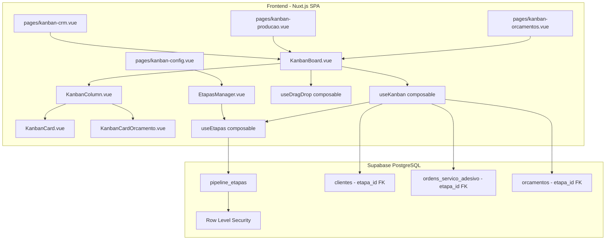
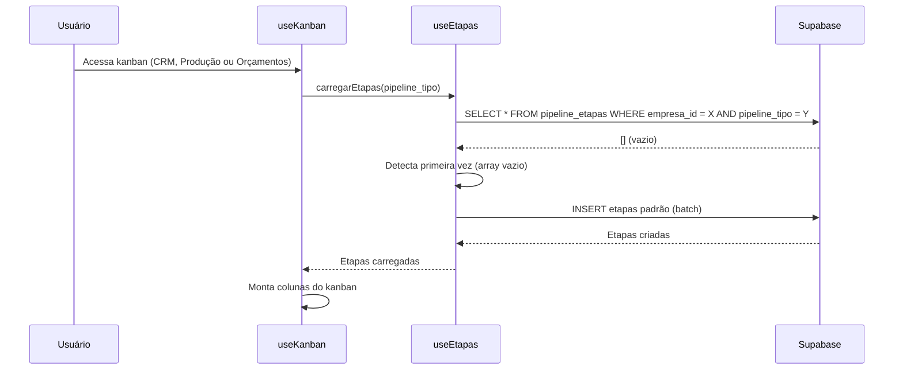

# Design Document: Kanban com Etapas Customizáveis

## Overview

Este design descreve a implementação do sistema de Kanban com Etapas Customizáveis para a aplicação CV PRO. O sistema substitui as colunas fixas de status (hardcoded no frontend) por etapas dinâmicas armazenadas no Supabase, permitindo que cada empresa configure seu próprio fluxo para três pipelines: CRM de Clientes, Produção de Ordens de Serviço e Orçamentos.

### Decisões de Design

1. **Tabela única `pipeline_etapas`**: Em vez de tabelas separadas para CRM e Produção, usamos uma única tabela com um campo `pipeline_tipo` discriminador. Isso simplifica o CRUD, as queries e o RLS.

2. **Drag and Drop nativo (sem bibliotecas)**: Conforme requisito 5.7, implementaremos usando HTML5 Drag and Drop API + Touch Events. Isso elimina dependências externas e mantém o bundle leve.

3. **Composable `useEtapas`**: Nova camada de serviço que encapsula toda a lógica de CRUD de etapas e seed de etapas padrão, seguindo o padrão existente dos composables (`useOrdensServico`, `useOrcamentos`).

4. **Composable `useKanban`**: Gerencia estado reativo do quadro kanban (colunas, cards, drag state) e operações de movimentação. O composable trata o pipeline `orcamentos` da mesma forma que `crm` e `producao` — a lógica de carregamento de etapas, movimentação de cards e seed automático é idêntica; apenas os dados (tabela de origem dos cards e seed data) diferem por `pipeline_tipo`.

5. **Migração não-destrutiva**: A coluna `etapa_id` é adicionada às tabelas existentes (`clientes`, `ordens_servico_adesivo` e `orcamentos`) como nullable, permitindo migração gradual dos dados existentes baseados em `status`.

## Architecture



### Fluxo de Inicialização (Seed de Etapas Padrão)



## Components and Interfaces

### Composable: `useEtapas`

```typescript
// app/composables/useEtapas.ts

export type PipelineTipo = 'crm' | 'producao' | 'orcamentos'

export interface Etapa {
  id: number
  empresa_id: number
  pipeline_tipo: PipelineTipo
  nome: string
  cor: string
  posicao: number
  is_final: boolean
  created_at: string
  updated_at: string
}

export interface CriarEtapaInput {
  nome: string
  cor: string
  pipeline_tipo: PipelineTipo
}

export interface AtualizarEtapaInput {
  nome?: string
  cor?: string
  is_final?: boolean
}

export function useEtapas() {
  // Carrega etapas de um pipeline (com seed automático na primeira vez)
  async function carregarEtapas(pipelineTipo: PipelineTipo): Promise<Etapa[]>

  // Cria nova etapa na última posição
  async function criarEtapa(input: CriarEtapaInput): Promise<Etapa>

  // Atualiza nome, cor ou is_final de uma etapa
  async function atualizarEtapa(etapaId: number, input: AtualizarEtapaInput): Promise<Etapa>

  // Remove etapa (somente se não houver itens associados)
  async function excluirEtapa(etapaId: number): Promise<void>

  // Reordena etapas (recebe array de IDs na nova ordem)
  async function reordenarEtapas(etapaIds: number[]): Promise<void>

  // Verifica se etapa tem itens associados
  async function etapaTemItens(etapaId: number, pipelineTipo: PipelineTipo): Promise<boolean>

  // Valida regras de negócio (mínimo 2 etapas, nome não vazio, etc.)
  function validarEtapa(input: CriarEtapaInput): { valid: boolean; errors: Record<string, string> }

  // Gera etapas padrão para um pipeline
  function gerarEtapasPadrao(pipelineTipo: PipelineTipo): Omit<Etapa, 'id' | 'empresa_id' | 'created_at' | 'updated_at'>[]
}
```

### Composable: `useKanban`

```typescript
// app/composables/useKanban.ts

export interface KanbanCard {
  id: number
  etapa_id: number
  titulo: string
  subtitulo?: string
  info_extra?: Record<string, string>
}

export interface KanbanState {
  etapas: Etapa[]
  cards: KanbanCard[]
  loading: boolean
  dragState: DragState | null
}

export function useKanban(pipelineTipo: PipelineTipo) {
  // Estado reativo
  const state: Ref<KanbanState>

  // Carrega etapas + cards do pipeline
  async function inicializar(): Promise<void>

  // Move card para outra etapa (com persistência)
  async function moverCard(cardId: number, novaEtapaId: number): Promise<void>

  // Retorna cards filtrados por etapa
  function cardsPorEtapa(etapaId: number): ComputedRef<KanbanCard[]>

  // Contagem de cards por etapa
  function contagemPorEtapa(etapaId: number): ComputedRef<number>
}
```

### Composable: `useDragDrop`

```typescript
// app/composables/useDragDrop.ts

export interface DragState {
  cardId: number
  sourceEtapaId: number
  currentOverEtapaId: number | null
}

export interface DragDropOptions {
  onDrop: (cardId: number, targetEtapaId: number) => Promise<void>
  onError: (error: Error) => void
}

export function useDragDrop(options: DragDropOptions) {
  const dragState: Ref<DragState | null>
  const isDragging: ComputedRef<boolean>

  // Inicia arraste (desktop)
  function onDragStart(event: DragEvent, cardId: number, etapaId: number): void

  // Marca coluna como alvo (desktop)
  function onDragOver(event: DragEvent, etapaId: number): void

  // Finaliza arraste (desktop)
  function onDrop(event: DragEvent, etapaId: number): void

  // Inicia arraste por toque longo (mobile)
  function onTouchStart(event: TouchEvent, cardId: number, etapaId: number): void

  // Move com toque (mobile)
  function onTouchMove(event: TouchEvent): void

  // Finaliza toque (mobile)
  function onTouchEnd(event: TouchEvent): void

  // Limpa estado
  function cancelDrag(): void
}
```

### Componentes Vue

| Componente | Responsabilidade |
|---|---|
| `KanbanBoard.vue` | Container principal, orquestra colunas e drag/drop |
| `KanbanColumn.vue` | Uma coluna do kanban (header + lista de cards + drop zone) |
| `KanbanCard.vue` | Card individual (template genérico para CRM e OS) |
| `KanbanCardCliente.vue` | Card específico para clientes (nome, telefone, última interação) |
| `KanbanCardOS.vue` | Card específico para OS (número, trabalho, cliente, valor, data) |
| `KanbanCardOrcamento.vue` | Card específico para orçamentos (número, cliente, valor total, data de criação) |
| `EtapasManager.vue` | Interface de gerenciamento de etapas (CRUD + reordenação) |
| `EtapaItem.vue` | Linha individual no gerenciador (nome, cor, ações) |

## Data Models

### Tabela: `pipeline_etapas`

```sql
CREATE TABLE pipeline_etapas (
  id BIGSERIAL PRIMARY KEY,
  empresa_id BIGINT NOT NULL REFERENCES empresas(id) ON DELETE CASCADE,
  pipeline_tipo TEXT NOT NULL CHECK (pipeline_tipo IN ('crm', 'producao', 'orcamentos')),
  nome TEXT NOT NULL,
  cor TEXT NOT NULL DEFAULT '#6b7280',
  posicao INTEGER NOT NULL DEFAULT 0,
  is_final BOOLEAN NOT NULL DEFAULT FALSE,
  created_at TIMESTAMPTZ NOT NULL DEFAULT now(),
  updated_at TIMESTAMPTZ NOT NULL DEFAULT now(),

  -- Garante unicidade de nome por empresa + pipeline
  CONSTRAINT uq_etapa_nome UNIQUE (empresa_id, pipeline_tipo, nome)
);

-- Índice para queries frequentes
CREATE INDEX idx_pipeline_etapas_empresa_tipo
  ON pipeline_etapas(empresa_id, pipeline_tipo, posicao);
```

### Alterações em tabelas existentes

```sql
-- Adiciona referência à etapa na tabela de clientes
ALTER TABLE clientes
  ADD COLUMN etapa_id BIGINT REFERENCES pipeline_etapas(id) ON DELETE SET NULL;

CREATE INDEX idx_clientes_etapa ON clientes(etapa_id);

-- Adiciona referência à etapa na tabela de OS
ALTER TABLE ordens_servico_adesivo
  ADD COLUMN etapa_id BIGINT REFERENCES pipeline_etapas(id) ON DELETE SET NULL;

CREATE INDEX idx_os_etapa ON ordens_servico_adesivo(etapa_id);

-- Adiciona referência à etapa na tabela de orçamentos
ALTER TABLE orcamentos
  ADD COLUMN etapa_id BIGINT REFERENCES pipeline_etapas(id) ON DELETE SET NULL;

CREATE INDEX idx_orcamentos_etapa ON orcamentos(etapa_id);
```

### Row Level Security

```sql
-- RLS para pipeline_etapas
ALTER TABLE pipeline_etapas ENABLE ROW LEVEL SECURITY;

CREATE POLICY "Empresa acessa suas etapas"
  ON pipeline_etapas
  FOR ALL
  USING (
    empresa_id = (
      SELECT empresa_id FROM profiles WHERE id = auth.uid()
    )
  )
  WITH CHECK (
    empresa_id = (
      SELECT empresa_id FROM profiles WHERE id = auth.uid()
    )
  );
```

### Etapas Padrão (Seed Data)

**Pipeline CRM:**
| Posição | Nome | Cor | is_final |
|---|---|---|---|
| 0 | Lead | #3b82f6 (blue) | false |
| 1 | Prospectando | #8b5cf6 (purple) | false |
| 2 | Orçamento Enviado | #f59e0b (amber) | false |
| 3 | Cliente Ativo | #10b981 (green) | false |
| 4 | Inativo | #6b7280 (gray) | true |

**Pipeline Produção:**
| Posição | Nome | Cor | is_final |
|---|---|---|---|
| 0 | Aguardando | #f59e0b (amber) | false |
| 1 | Impressão | #3b82f6 (blue) | false |
| 2 | Corte | #8b5cf6 (purple) | false |
| 3 | Aplicação | #ec4899 (pink) | false |
| 4 | Pronto | #10b981 (green) | false |
| 5 | Entregue | #059669 (emerald) | true |

**Pipeline Orçamentos:**
| Posição | Nome | Cor | is_final |
|---|---|---|---|
| 0 | Novo | #f59e0b (amber) | false |
| 1 | Em Análise | #3b82f6 (blue) | false |
| 2 | Enviado | #8b5cf6 (purple) | false |
| 3 | Aprovado | #10b981 (green) | false |
| 4 | Reprovado | #ef4444 (red) | true |

### Trigger de updated_at

```sql
CREATE OR REPLACE FUNCTION update_updated_at()
RETURNS TRIGGER AS $$
BEGIN
  NEW.updated_at = now();
  RETURN NEW;
END;
$$ LANGUAGE plpgsql;

CREATE TRIGGER trg_pipeline_etapas_updated_at
  BEFORE UPDATE ON pipeline_etapas
  FOR EACH ROW
  EXECUTE FUNCTION update_updated_at();
```


## Correctness Properties

*A property is a characteristic or behavior that should hold true across all valid executions of a system — essentially, a formal statement about what the system should do. Properties serve as the bridge between human-readable specifications and machine-verifiable correctness guarantees.*

### Property 1: Cores únicas nas etapas padrão

*For any* pipeline type ('crm', 'producao', or 'orcamentos'), the generated default stages SHALL have all distinct color values — no two stages in the same default set share the same color.

**Validates: Requirements 1.4**

### Property 2: Nova etapa posicionada após a última

*For any* existing set of stages in a pipeline (with arbitrary positions), creating a new stage SHALL assign it a position value equal to max(existing positions) + 1. If no stages exist, position SHALL be 0.

**Validates: Requirements 2.1**

### Property 3: Reordenação produz posições sequenciais

*For any* list of stage IDs representing a new order, the reorder operation SHALL assign positions 0, 1, 2, ..., N-1 to the stages in the specified order, where N is the number of stages.

**Validates: Requirements 2.3**

### Property 4: Exatamente uma Etapa_Final por pipeline

*For any* pipeline and any stage marked as is_final, the resulting pipeline state SHALL contain exactly one stage with is_final=true. All other stages in the same pipeline SHALL have is_final=false.

**Validates: Requirements 2.7**

### Property 5: Mínimo de duas etapas por pipeline

*For any* pipeline with exactly 2 stages, attempting to delete one stage SHALL be rejected by validation. For any pipeline with more than 2 stages, deletion validation SHALL pass (assuming no items are associated).

**Validates: Requirements 2.8**

### Property 6: Ordenação de etapas por posição é estável

*For any* set of stages with distinct position values, sorting by the `posicao` field SHALL always produce the same deterministic order, and this order SHALL be used for column rendering in the kanban.

**Validates: Requirements 3.1, 4.1**

### Property 7: Mover para Etapa_Final registra conclusão

*For any* item (OS or orçamento) moved to a stage where is_final=true, the system SHALL set the conclusion date (data_conclusao) to the current timestamp. For any item moved to a non-final stage, data_conclusao SHALL remain null.

**Validates: Requirements 4.3, 5.6**

### Property 8: Rollback restaura estado original em caso de falha

*For any* card drag operation where the persistence fails, the card SHALL be returned to its original etapa_id (source column), and the UI state SHALL match the pre-drag state.

**Validates: Requirements 5.6**

### Property 9: Unicidade de nome por empresa e pipeline

*For any* empresa_id and pipeline_tipo, attempting to create a stage with a name that already exists in that combination SHALL be rejected. Names in different pipelines or different empresas SHALL NOT conflict.

**Validates: Requirements 6.2**

## Error Handling

### Categorias de Erro

| Cenário | Comportamento | UX |
|---|---|---|
| Falha ao carregar etapas | Retry automático (3x com backoff), depois exibe mensagem | Toast de erro + botão "Tentar novamente" |
| Falha ao mover card (drag) | Reverte card para coluna original | Toast "Não foi possível mover. Tente novamente." |
| Falha ao criar etapa | Não adiciona à lista, mantém formulário preenchido | Mensagem de erro inline |
| Nome de etapa duplicado | Rejeita criação/renomeação | Mensagem "Já existe uma etapa com este nome" |
| Tentar excluir etapa com itens | Bloqueia operação | Modal informativo com contagem de itens |
| Tentar excluir quando pipeline tem 2 etapas | Bloqueia operação | Toast "Pipeline deve ter no mínimo 2 etapas" |
| Sessão expirada durante operação | Redireciona para login | Redirect automático |
| Erro de RLS (acesso negado) | Log de erro, não expõe detalhes | Toast genérico "Erro ao acessar dados" |

### Validações no Frontend

```typescript
function validarEtapa(input: CriarEtapaInput): { valid: boolean; errors: Record<string, string> } {
  const errors: Record<string, string> = {}

  if (!input.nome || input.nome.trim().length === 0) {
    errors.nome = 'Nome da etapa é obrigatório'
  }
  if (input.nome && input.nome.trim().length > 50) {
    errors.nome = 'Nome deve ter no máximo 50 caracteres'
  }
  if (!input.cor || !/^#[0-9a-fA-F]{6}$/.test(input.cor)) {
    errors.cor = 'Cor inválida (formato: #RRGGBB)'
  }

  return { valid: Object.keys(errors).length === 0, errors }
}
```

### Optimistic UI com Rollback

Para operações de drag and drop, utilizamos atualização otimista:

1. **Imediatamente**: Move o card visualmente para a nova coluna
2. **Em background**: Persiste a mudança no Supabase
3. **Em caso de erro**: Reverte o card para a coluna original e exibe toast

## Testing Strategy

### Abordagem Dual: Testes Unitários + Property-Based Tests

**Property-Based Tests** (usando `fast-check` já instalado no projeto):
- Cada property do documento será implementada como um teste PBT com mínimo de 100 iterações
- Tag format: `Feature: kanban-etapas-customizaveis, Property {N}: {título}`
- Foco nas funções puras dos composables: `gerarEtapasPadrao`, `validarEtapa`, lógica de reordenação, lógica de is_final

**Unit Tests** (usando `vitest`):
- Testes example-based para cenários específicos de seed (etapas padrão exatas)
- Testes de edge cases (pipeline vazio, nomes com caracteres especiais)
- Testes de validação de input

**Integration Tests**:
- Testes contra Supabase para verificar RLS, constraints, e triggers
- Testes de movimentação de cards com persistência real

### Estrutura de Testes

```
tests/
  unit/
    useEtapas.spec.ts          # Unit + PBT para lógica de etapas
    useEtapas.property.spec.ts # Property tests dedicados
    useKanban.spec.ts          # Unit tests para lógica de kanban
    useDragDrop.spec.ts        # Unit tests para drag/drop state
```

### Configuração PBT

```typescript
import fc from 'fast-check'

// Cada property test roda com mínimo 100 iterações
const PBT_CONFIG = { numRuns: 100 }

// Generators comuns
const etapaGen = fc.record({
  id: fc.nat(),
  posicao: fc.nat({ max: 50 }),
  nome: fc.string({ minLength: 1, maxLength: 50 }),
  cor: fc.hexaString({ minLength: 6, maxLength: 6 }).map(s => `#${s}`),
  is_final: fc.boolean(),
})

const pipelineTipoGen = fc.constantFrom('crm', 'producao', 'orcamentos')
```

### Cobertura esperada

| Área | Tipo de Teste | Quantidade |
|---|---|---|
| gerarEtapasPadrao | Example + Property | 4 examples + 1 property |
| validarEtapa | Property | 2 properties |
| Reordenação | Property | 1 property |
| is_final toggle | Property | 1 property |
| Mínimo 2 etapas | Property | 1 property |
| Mover para final | Property | 1 property |
| Rollback | Property | 1 property |
| Unicidade de nome | Property | 1 property |
| Drag/Drop state | Unit (example) | 5-8 tests |
| Componentes Vue | Unit (example) | 5-10 tests |

