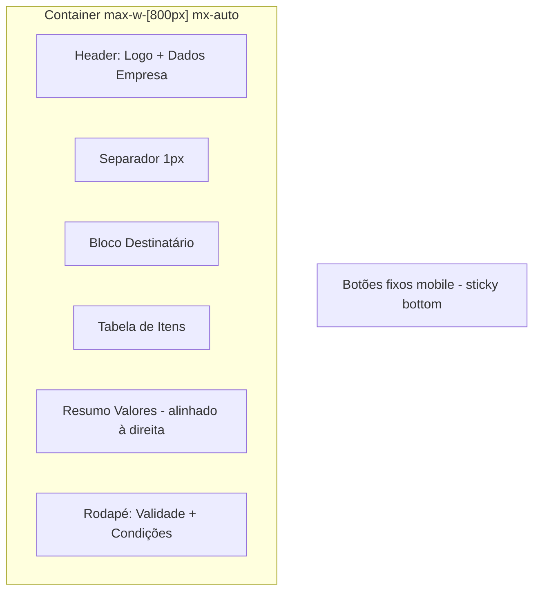

# Design Document: Premium Design System

## Overview

Este documento descreve o redesign completo do sistema visual do App CV PRO, transformando a interface atual em uma experiência premium adequada a grandes empresas de comunicação visual. O sistema preserva o mecanismo existente de temas dinâmicos via CSS custom properties (`--color-primary`, `--color-sidebar`, `--color-card`, etc.) e refina todos os componentes visuais sem alterar funcionalidade.

A abordagem é baseada em **design tokens** que alimentam componentes reutilizáveis. Cada token (tipografia, espaçamento, sombra, borda) será definido no `tailwind.config.ts` e no `main.css`, garantindo que mudanças de design propagam automaticamente para toda a aplicação.

### Decisões-Chave de Design

| Decisão | Escolha | Justificativa |
|---------|---------|---------------|
| Escala tipográfica | 6 níveis (Display→Caption) com Inter | Hierarquia clara sem excesso de variação |
| Espaçamento | Múltiplos de 4px | Alinhamento a grade de 4px (padrão indústria) |
| Border-radius | Reduzido de 16px→12px em cards | Formalidade — cards arredondados demais parecem casuais |
| Botões altura máxima | 40px (md), 44px (lg) | Proporção elegante sem parecer "inchado" |
| Modal overlay | blur 4px + 40% opacidade | Mais leve que o atual (blur 14px + 60%) para manter contexto |
| Proposta Comercial | Layout fiscal 800px | Mimetiza documentos fiscais brasileiros (NF-e) |

## Architecture

### Diagrama de Camadas do Design System

```mermaid
graph TD
    subgraph "Design Tokens Layer"
        A[CSS Custom Properties<br/>--color-*, --spacing-*, --radius-*]
        B[Tailwind Config<br/>theme.extend.*]
    end

    subgraph "Base Styles Layer"
        C[main.css<br/>Utility classes, resets, animations]
    end

    subgraph "Component Layer"
        D[AppButton.vue]
        E[AppInput.vue]
        F[AppCard.vue]
        G[AppModal.vue]
        H[AppTable.vue]
        I[AppSidebar.vue]
        J[PageTemplate.vue]
    end

    subgraph "Page Layer"
        K[Pages internas do sistema]
        L[Proposta Comercial<br/>/orcamento-aprovacao/[token]]
    end

    A --> B
    B --> C
    C --> D & E & F & G & H & I & J
    D & E & F & G & H & I & J --> K & L
```

### Estratégia de Implementação

1. **Tokens primeiro**: Atualizar `tailwind.config.ts` e `main.css` com novos valores de escala tipográfica, espaçamento e sombras.
2. **Componentes base**: Refatorar `AppButton`, criar/atualizar `AppInput`, `AppCard`, `AppModal`, `AppTable`.
3. **Template de página**: Criar composable/layout padrão com header, spacing e loading states.
4. **Sidebar**: Refinar opacidades, transições e tooltips.
5. **Proposta Comercial**: Redesign completo da página `/orcamento-aprovacao/[token]`.
6. **Consistência**: Aplicar os novos tokens em todas as páginas existentes.

## Components and Interfaces

### 1. Design Tokens (tailwind.config.ts + main.css)

#### Escala Tipográfica

```typescript
// Adições ao tailwind.config.ts → theme.extend
fontSize: {
  'display': ['2.25rem', { lineHeight: '1.2', letterSpacing: '-0.025em', fontWeight: '700' }],
  'h1':      ['1.75rem', { lineHeight: '1.2', letterSpacing: '-0.02em', fontWeight: '700' }],
  'h2':      ['1.375rem', { lineHeight: '1.25', letterSpacing: '-0.01em', fontWeight: '600' }],
  'h3':      ['1rem', { lineHeight: '1.3', fontWeight: '600' }],
  'body':    ['0.875rem', { lineHeight: '1.6', fontWeight: '400' }],
  'caption': ['0.75rem', { lineHeight: '1.5', fontWeight: '400' }],
}
```

#### Escala de Espaçamento (já existe com Tailwind, mas reforçar uso consistente)

Valores base: `1 (4px)`, `2 (8px)`, `3 (12px)`, `4 (16px)`, `5 (20px)`, `6 (24px)`, `8 (32px)`, `10 (40px)`, `12 (48px)`, `16 (64px)`.

#### Sombras Atualizadas

```typescript
boxShadow: {
  'card':    '0 1px 3px 0 rgb(0 0 0 / .04), 0 1px 2px -1px rgb(0 0 0 / .04)',
  'card-hover': '0 4px 12px -2px rgb(0 0 0 / .08), 0 2px 4px -2px rgb(0 0 0 / .04)',
  'panel':   '0 4px 6px -1px rgb(0 0 0 / .06), 0 2px 4px -2px rgb(0 0 0 / .05)',
  'modal':   '0 20px 60px -12px rgb(0 0 0 / .25), 0 8px 20px -8px rgb(0 0 0 / .1)',
  'header':  '0 10px 15px -3px rgb(0 0 0 / .08), 0 4px 6px -4px rgb(0 0 0 / .06)',
}
```

#### Border-Radius Atualizados

```typescript
borderRadius: {
  'badge':  '9999px',
  'input':  '0.5rem',    // 8px (antes 12px)
  'btn':    '0.5rem',    // 8px default, ajustável por tema
  'btn-lg': '0.625rem',  // 10px
  'card':   '0.75rem',   // 12px (antes 16px)
  'panel':  '1rem',      // 16px (antes 24px)
  'modal':  '1rem',      // 16px (antes 24px)
  'header': '1rem',
}
```

---

### 2. AppButton.vue (Refatorado)

**Interface (Props)**:
```typescript
interface AppButtonProps {
  variant: 'primary' | 'secondary' | 'danger' | 'outline' | 'ghost' | 'white'
  size: 'xs' | 'sm' | 'md' | 'lg'
  type: 'button' | 'submit' | 'reset'
  disabled: boolean
  loading: boolean
}
```

**Mudanças de estilo**:
- Tamanho `md`: `h-10 px-4 text-[13px] font-medium` (antes: `px-5 py-2.5 text-sm font-semibold`)
- Tamanho `lg`: `h-11 px-5 text-[15px] font-medium` (antes: `px-7 py-3.5 text-base`)
- Tamanho `sm`: `h-8 px-3 text-[13px] font-medium`
- Border-radius: `rounded-lg` (8px) em vez de `rounded-xl` (12px)
- Transição: `transition-all duration-150` com `active:scale-[0.98]`
- Variant `secondary` em tema escuro: `border border-primary-10 bg-primary-5`
- Variant `outline` em tema escuro: `border border-primary-20`

---

### 3. AppCard.vue (Novo Componente)

**Interface (Props)**:
```typescript
interface AppCardProps {
  elevation: 'flat' | 'raised' | 'elevated'
  padding: 'none' | 'sm' | 'md' | 'lg'
}
```

**Slots**: `header`, `default` (body), `footer`

**Estilos por elevação**:
- `flat`: `border border-primary-border rounded-xl` (sem sombra)
- `raised`: `border border-primary-border rounded-xl shadow-card`
- `elevated`: `border border-primary-border rounded-xl shadow-panel`

**Header interno**: `pb-4 border-b border-primary-border` com título em `text-h3`

---

### 4. AppInput.vue (Novo/Refatorado)

**Interface (Props)**:
```typescript
interface AppInputProps {
  modelValue: string | number
  label?: string
  placeholder?: string
  error?: string
  size: 'md' | 'lg'
  type: string
  disabled: boolean
}
```

**Estilos**:
- Altura: `h-10` (md) / `h-11` (lg)
- Padding: `px-3.5`
- Border-radius: `rounded-lg` (8px)
- Label: `text-[13px] font-medium mb-1.5`
- Focus: `ring-2 ring-primary ring-offset-2 transition-all duration-150`
- Erro: `border-error` + mensagem em `text-xs text-error mt-1.5` com ícone inline

---

### 5. AppModal.vue (Refatorado)

**Interface (Props)**:
```typescript
interface AppModalProps {
  show: boolean
  size: 'sm' | 'md' | 'lg'
  title: string
  closable: boolean
}
```

**Tamanhos**: `sm: max-w-[400px]`, `md: max-w-[540px]`, `lg: max-w-[680px]`

**Estrutura**:
- Overlay: `bg-black/40 backdrop-blur-[4px]`
- Header: `px-6 py-5` com título + botão fechar, separador `border-b`
- Body: `px-6 py-5 overflow-y-auto` (scroll interno quando excede altura)
- Footer: `px-6 py-5 border-t` com botões alinhados à direita
- Animação entrada: `translate-y-2 opacity-0 → translate-y-0 opacity-100` em 200ms ease-out

---

### 6. AppTable.vue (Novo Componente)

**Interface (Props)**:
```typescript
interface Column {
  key: string
  label: string
  align?: 'left' | 'center' | 'right'
  minWidth?: string
  numeric?: boolean
}

interface AppTableProps {
  columns: Column[]
  data: any[]
  loading: boolean
  stickyHeader: boolean
  emptyTitle?: string
  emptyDescription?: string
}
```

**Estilos**:
- Header: `bg-primary-5 text-[11px] font-semibold uppercase tracking-[0.05em] px-4 py-3`
- Células: `px-4 py-3 text-[13px]`
- Hover: `hover:bg-primary-5 transition-colors duration-100`
- Numéricos: `text-right font-[tabular-nums]`
- Sticky header: `sticky top-0 z-10`
- Scroll horizontal: container com `overflow-x-auto`

---

### 7. PageTemplate (Layout Pattern)

**Estrutura padrão** aplicada a todas as páginas:

```vue
<!-- Padrão de header de página -->
<div class="flex items-center justify-between mb-6">
  <div>
    <h1 class="text-h1">{{ titulo }}</h1>
    <p v-if="subtitulo" class="text-body text-primary-400 mt-1">{{ subtitulo }}</p>
  </div>
  <div class="flex items-center gap-3">
    <!-- Botões de ação -->
  </div>
</div>
```

- Padding de página: `px-6 md:px-8 lg:px-12`
- Gap entre header e conteúdo: `mb-6` (24px)
- Gap entre seções: `space-y-8` (32px)
- Loading state: skeleton com `animate-pulse bg-primary-5 rounded-lg`
- Empty state: ícone + título + descrição centralizados

---

### 8. AppSidebar.vue (Refinamentos)

**Mudanças**:
- Itens inativos: `opacity-60` (antes: `opacity-55`)
- Item ativo: `opacity-100 bg-white/12`
- Transição largura: `duration-250 cubic-bezier(0.4, 0, 0.2, 1)` (ajuste de 280ms → 250ms)
- Ícones: `w-5 h-5` com `stroke-width: 1.5`
- Tooltip em estado colapsado: delay 300ms, posição à direita
- Labels de seção: `text-[10px] font-bold uppercase opacity-40`
- Gap entre seções: `gap-5` (20px)

---

### 9. Proposta Comercial (Redesign)

**Estrutura layout fiscal**:



**Especificações**:
- Container: `max-w-[800px] mx-auto bg-white border border-gray-200`
- Header: logo à esquerda, dados empresa à direita (nome, CNPJ, endereço, telefone)
- Destinatário: label "DESTINATÁRIO" em `text-[11px] font-semibold uppercase text-gray-400`
- Tabela: colunas Item | Descrição | Qtd | Valor Unit. | Total com header cinza claro e linhas alternadas (`even:bg-gray-50`)
- Total: `text-xl font-bold` alinhado à direita
- Rodapé: `text-xs text-gray-500`
- Botões mobile: `fixed bottom-0 inset-x-0 bg-white shadow-[0_-4px_12px_rgba(0,0,0,0.08)] p-4`
- Feedback aprovação/rejeição: animação de 400ms com `transition: transform 400ms ease, opacity 400ms ease`

## Data Models

### Design Tokens Model

Os tokens de design não persistem em banco — são definidos em código (Tailwind config + CSS). O modelo conceitual:

```typescript
interface TypographyToken {
  level: 'display' | 'h1' | 'h2' | 'h3' | 'body' | 'caption'
  fontSize: string        // rem
  lineHeight: string      // unitless ratio
  letterSpacing: string   // em
  fontWeight: 400 | 500 | 600 | 700
}

interface SpacingToken {
  key: string             // '1' | '2' | '3' | ... | '16'
  value: string           // px
}

interface ElevationToken {
  level: 'flat' | 'raised' | 'elevated'
  shadow: string          // CSS box-shadow value
  border: string          // CSS border value
}

interface ButtonSizeToken {
  size: 'xs' | 'sm' | 'md' | 'lg'
  height: string          // px
  paddingX: string        // px
  fontSize: string        // px
  fontWeight: number
}

interface ModalSizeToken {
  size: 'sm' | 'md' | 'lg'
  maxWidth: string        // px
}
```

### Tema Dinâmico (existente, sem alteração)

O sistema de temas dinâmicos já existe e será preservado. As CSS custom properties continuam sendo definidas pelo composable `usePersonalizacao` e pelo script inline no `<head>`:

```typescript
// Variáveis existentes (sem mudança)
interface ThemeConfig {
  cor_primaria: string
  cor_primaria_grad?: string
  cor_primaria_texto: string
  cor_fundo: string
  cor_fundo_grad?: string
  cor_sidebar: string
  cor_sidebar_grad?: string
  cor_botao: string
  cor_botao_texto: string
  cor_icone: string
  cor_card?: string
  cor_card_texto?: string
  grad_direction?: string
}
```

## Correctness Properties

*A property is a characteristic or behavior that should hold true across all valid executions of a system — essentially, a formal statement about what the system should do. Properties serve as the bridge between human-readable specifications and machine-verifiable correctness guarantees.*

### Por que PBT não se aplica a este feature

Este feature trata exclusivamente de **UI rendering, layout CSS e consistência visual**. Property-based testing (PBT) não é adequado porque:

- Os requisitos definem valores concretos e estáticos de CSS (padding 24px, font-size 13px, opacity 0.6, border-radius 8px)
- Não há transformação de dados, parsing, serialização ou lógica algorítmica com input variável
- O comportamento não varia significativamente com diferentes inputs — são regras declarativas de estilo
- O que importa é a aparência renderizada, não uma propriedade computacional universalmente quantificável

**Estratégias de teste adequadas**: visual regression tests (snapshot/screenshot), unit tests de exemplo para comportamento de componentes, e auditorias de acessibilidade automatizadas.

### Invariantes Visuais e Comportamentais

Embora não sejam testáveis via PBT, os seguintes invariantes devem ser mantidos em todas as configurações de tema e breakpoints:

| # | Invariante | Requisitos Relacionados |
|---|-----------|------------------------|
| 1 | Contraste mínimo WCAG AA (4.5:1) entre texto e fundo em todos os cards e superfícies | Req 4.6 |
| 2 | Contraste mínimo 3:1 para texto decorativo (labels de seção, captions com opacidade reduzida) | Req 9.5 |
| 3 | Escala de espaçamento consistente em múltiplos de 4px — nenhum valor fora da escala definida | Req 2.1 |
| 4 | Font-weight em headings reduzido em 1 nível quando tema escuro está ativo (700→600, 600→500) | Req 1.5 |
| 5 | Botões nunca excedem 40px (md) ou 44px (lg) de altura, independente do conteúdo | Req 3.1 |
| 6 | Modais mantêm header e footer fixos com body scrollável quando conteúdo excede viewport | Req 7.6 |
| 7 | Sidebar colapsada exibe tooltip após exatamente 300ms de hover | Req 9.4 |
| 8 | Proposta comercial mantém largura máxima de 800px e layout fiscal em qualquer viewport ≥ 800px | Req 5.1 |
| 9 | Tabelas com >10 linhas mantêm header sticky durante scroll vertical | Req 10.5 |
| 10 | Valores numéricos/monetários em tabelas usam `font-variant-numeric: tabular-nums` e alinhamento à direita | Req 10.6 |

Estes invariantes são verificados via **visual regression tests**, **snapshot tests** e **accessibility audits automatizados** (axe-core), conforme detalhado na seção Testing Strategy.

### Property 1: Contraste WCAG AA em todas as combinações tema × superfície

*Para qualquer* combinação de cor de tema dinâmico e superfície de card/modal/página, o contraste entre texto e fundo deve ser ≥ 4.5:1 (WCAG AA para texto normal) e ≥ 3:1 para texto decorativo (labels de seção, captions).

**Validates: Requirements 4.6, 9.5**

### Property 2: Adaptação tipográfica em tema escuro

*Para qualquer* heading renderizado em tema escuro, o font-weight aplicado deve ser exatamente um nível inferior ao definido para tema claro (700→600, 600→500), mantendo legibilidade equivalente.

**Validates: Requirements 1.5**

## Error Handling

### Estratégias de Fallback Visual

| Situação | Comportamento |
|----------|---------------|
| Tema não carregado | Valores default definidos em `:root` (cinzas neutros) |
| Fonte Inter não disponível | Fallback para `ui-sans-serif, system-ui, sans-serif` |
| Logo da empresa ausente | Ícone placeholder (sparkles) com fundo sutil |
| Dados da empresa incompletos | Seções com dados ausentes são ocultadas (v-if) |
| Imagens de arte/local falharam | Container com ícone de imagem quebrada e borda tracejada |
| Tabela sem dados | Empty state com ícone, título e descrição |
| Operação assíncrona falhou | Toast de erro + restaurar estado do botão |

### Validação de Contraste

- Todos os textos sobre superfícies de card devem manter razão de contraste ≥ 4.5:1 (WCAG AA)
- Em temas escuros, font-weight de headings é reduzido automaticamente (700→600, 600→500) para compensar o aumento percebido de peso em fundo escuro
- Labels em opacidade reduzida (seções sidebar, captions) mantêm mínimo de 3:1 para texto decorativo

### Responsividade e Breakpoints

- Mobile (< 640px): padding de página 24px, botões full-width, modal ocupa 100% da viewport
- Tablet (640px–1024px): padding 32px, layout adaptável
- Desktop (> 1024px): padding 48px, layouts de grid, sidebar expandida

## Testing Strategy

### Abordagem de Testes

Como este feature trata exclusivamente de **UI rendering, layout CSS e consistência visual**, property-based testing (PBT) **não se aplica**. Os critérios de aceitação definem valores específicos de pixel, opacidade e duração que são verificáveis por inspeção visual e testes de snapshot/regressão visual.

**Por que PBT não é adequado aqui:**
- Os requisitos definem valores concretos de CSS (padding 24px, font-size 13px, opacity 0.6)
- Não há transformação de dados ou lógica com input variável
- O comportamento não varia significativamente com diferentes inputs — são regras estáticas de estilo
- O que importa é a aparência renderizada, não uma propriedade computacional

### Estratégia de Testes Recomendada

#### 1. Visual Regression Tests (Primário)

Utilizar **Percy**, **Chromatic** ou **Playwright visual comparisons** para capturar screenshots de cada componente e página em múltiplos estados:

- Cada componente em todos os tamanhos e variantes
- Tema claro vs tema escuro
- Estados: default, hover, focus, disabled, loading, error
- Breakpoints: mobile (375px), tablet (768px), desktop (1440px)

#### 2. Snapshot Tests (Complementar)

Utilizar **Vitest + @vue/test-utils** para snapshot testing da estrutura HTML renderizada:

- `AppButton` — todas as combinações de variant × size
- `AppCard` — 3 elevações com e sem header/footer
- `AppModal` — 3 tamanhos com conteúdo scrollável
- `AppTable` — com dados, sem dados (empty state), com sticky header
- `AppInput` — estados normal, focus, error, disabled

#### 3. Unit Tests (Comportamento)

Testes de exemplo para comportamentos específicos:

- Modal fecha ao clicar overlay (quando closable=true)
- Modal NÃO fecha ao clicar overlay (quando closable=false)
- Tooltip da sidebar aparece após 300ms de hover no estado colapsado
- Botão mostra spinner quando loading=true
- Input exibe mensagem de erro quando prop `error` está preenchida
- Tabela aplica sticky header quando dados > 10 linhas
- Proposta comercial: botões ficam fixos no bottom em viewport mobile

#### 4. Accessibility Tests

- Verificar contraste mínimo 4.5:1 em todas as combinações texto/fundo
- Verificar que focus rings são visíveis em todos os componentes interativos
- Verificar que modais gerenciam focus trap corretamente
- Verificar aria-labels em tooltips da sidebar

#### 5. Testes Manuais de Tema

- Aplicar 5 temas distintos (cores claras, escuras, saturadas) e verificar que:
  - Todos os componentes permanecem legíveis
  - Bordas e sombras adaptam-se corretamente
  - Botões mantêm proporção e legibilidade
  - Contraste WCAG AA é mantido

### Ferramentas Recomendadas

| Ferramenta | Propósito |
|------------|-----------|
| Vitest | Unit tests e snapshot tests |
| @vue/test-utils | Renderização de componentes Vue |
| Playwright | Visual regression + E2E |
| axe-core | Audit de acessibilidade automatizado |
| tailwind-contrast | Verificação programática de contraste |
